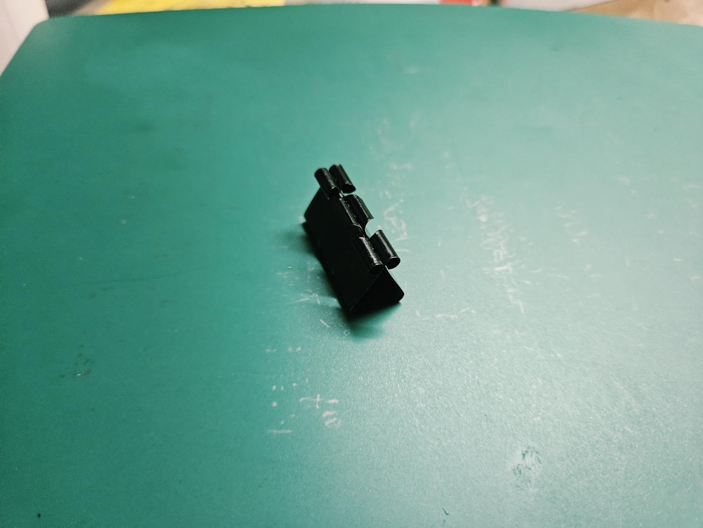
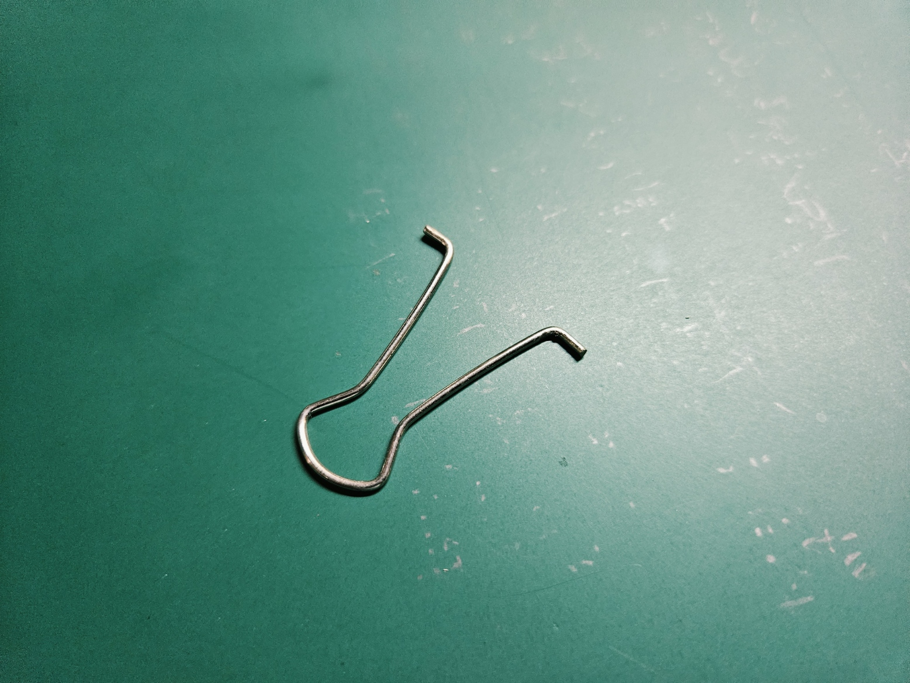
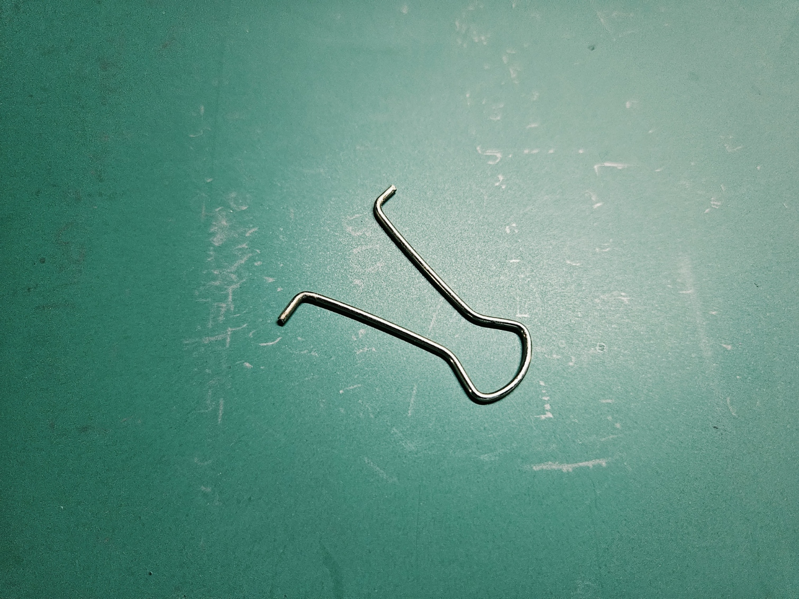

# A1: Build Your Professional Portfolio

## Part 2: Decide

These three decisions were made before building out the rest of this page, as required by the assignment.

---

### Decision 1: Homepage Identity

The homepage is written for someone visiting this portfolio for the first time, whether that is a grader, a classmate, or a recruiter. It opens with the course name and the Analyze/Decide/Communicate framework because that tells the reader how each assignment is structured, not just where to find it. The semester arc section gives a quick map of how the assignments build on each other so the reader does not have to click through the sidebar blindly. The About Me section sits directly on the homepage instead of behind a separate link because the most common visitor (someone scanning quickly) needs to see both who I am and how the portfolio is organized without an extra click. Everything on the homepage is there to help the reader orient themselves faster. Anything that only served my own self-expression was left out.

---

### Decision 2: One Intentional Customization

**What changed:** The primary theme color was changed from `green` to `indigo` in `mkdocs.yml`.

**What requirement this better satisfies:** The Material for MkDocs theme uses the primary color for the top navigation bar, sidebar highlights, and link accents. The default green (#4CAF50) has a WCAG contrast ratio of roughly 3.1:1 against white backgrounds, which falls below the 4.5:1 recommendation for text-adjacent UI elements. Indigo (#3F51B5) hits about 5.9:1 against white, which makes navigation elements easier to distinguish from body text at a glance. On top of that, indigo aligns with the aerospace domain (think avionics displays and artificial horizon indicators), which fits the focus of my work better than a generic green.

**Why the default did not meet the requirement:** Green provided lower contrast for navigation scanning and had no functional connection to the content domain of this portfolio.

---

### Decision 3: Documentation Standard

Every entry in this portfolio will state the governing equation or model, define all variables with units, present at least one alternative that was considered, and justify the final selection with a rationale tied to a stated requirement, all documented so that another engineer could reproduce the analysis without asking me a question.

---

## Part 1: Analyze

---

### Task A: Portfolio Analysis

Two engineering portfolios were found and evaluated against four criteria: navigability, reproducibility, evidence of reasoning, and professional tone.

---

#### Portfolio 1: Rick Meade (GitHub Pages)

**URL:** [https://rjmeade.github.io/](https://rjmeade.github.io/)

**a. Navigability:** The site is a single-page layout with project cards sorted by discipline (aerospace, robotics, optimization). Every project is one click from the landing page. A visitor scanning for a specific project can find it in about 15 seconds without digging through nested menus, well under the 60-second threshold.

**b. Reproducibility:** Some projects include analytical formulations and optimization parameters. The path planning project defines geometric boundary conditions, and the aircraft project outlines topology optimization objectives (minimizing compliance under volume fraction constraints). That said, there are no downloadable CAD files, mesh configs, or dimensioned drawings. A reader could follow the reasoning, but they would have to rebuild the geometry from scratch. Reproducibility covers the logic but not the fabrication.

**c. Evidence of reasoning:** This is where the portfolio stands out. Instead of just showing finished CAD models, it walks through the iteration process. The aircraft structure was shaped by stress distributions under gust loading, not by guessing at shapes. The UGV chassis design traces back to impact deceleration equations and mass budgets. You can see why each design looks the way it does.

**d. Professional tone:** The writing uses domain-specific terms (topology optimization, convex cellular decomposition, impact attenuation) without filler or hype. Claims are supported by context like project scope and engineering roles. It reads like something you could hand to an employer without editing.

---

#### Portfolio 2: Julian Zachar-Fink (Custom Domain)

**URL:** [https://julianzacharfink.com/](https://julianzacharfink.com/)

**a. Navigability:** Projects are organized by semester with a consistent internal structure: Problem Definition, Technical Specs, Calculations, CAD/Manufacturing, and Validation. Once you learn the layout of one project page, you can predict where to find the same content in every other project. Time to locate a specific calculation or BOM is about 20 seconds.

**b. Reproducibility:** This portfolio sets a higher bar. The plastic compactor project includes a 3:1 compaction ratio, lead screw torque calculations, gear ratios, and a full bill of materials with unit costs (822 DKK against a 4,500 DKK retail target). Between the kinematic sketches, power ratings, and cost tables, a team could build a working prototype from this documentation alone.

**c. Evidence of reasoning:** Every design choice traces back to a constraint or trade study. The sorting system project explains why standard NIR sensing failed on carbon-black plastics (total absorption), which justified switching to short-wave infrared spectroscopy. Motor selection was balanced against duty cycle limits and noise. Pugh matrices and failure mode analyses are included, so you can follow the full decision chain from requirements to final design.

**d. Professional tone:** Written in a formal European engineering report style with precise terminology (kinematic synthesis, transmission efficiency, DFMA). The language is focused on specs, tolerances, and constraints rather than opinions.

---

#### Summary

| Criterion | Portfolio 1 (Meade) | Portfolio 2 (Zachar-Fink) |
|---|---|---|
| **Navigability** | Single-page cards, ~15 s | Semester layout, ~20 s |
| **Reproducibility** | Logic recoverable, no fab data | Enough to build a prototype |
| **Reasoning** | Optimization-driven iteration | Pugh matrices, failure modes |
| **Tone** | Aerospace vocabulary, objective | ISO-style report format |

Portfolio 2 scores higher on reproducibility because it includes manufacturing costs and component-level specs. Portfolio 1 is faster to navigate due to its flat layout. Both demonstrate that the value of a portfolio is in the reasoning behind the design, not just the final result.

---

### Task B: Product Analysis (Binder Clip)

---

#### a. Primary Function

The binder clip converts stored elastic strain energy in a preloaded flexure spring into a sustained normal contact force that produces friction-based shear retention of a sheet stack. In simpler terms, it squeezes paper together hard enough that friction alone keeps the sheets from sliding apart, and it does this without punching holes or permanently deforming the paper.

---

#### b. Governing Model

Two mechanical systems are at work:

**1. Clamping force (spring behavior)**

The triangular body acts as a symmetric dual-cantilever flexure spring. From beam theory:

$$F_{\text{clamp}} = \frac{E \cdot w \cdot t^3}{4L^3} \cdot (t_{\text{stack}} - g_0)$$

| Variable | What it is | Unit |
|---|---|---|
| $F_{\text{clamp}}$ | Clamping force on the paper | N |
| $E$ | Young's modulus of spring steel (~200 GPa) | Pa |
| $w$ | Width of the clip body | m |
| $t$ | Thickness of the steel sheet | m |
| $L$ | Length of each side flange (apex to lip) | m |
| $t_{\text{stack}}$ | Thickness of the paper stack | m |
| $g_0$ | Resting jaw gap (often zero or negative for preload) | m |

For the paper to stay put, Coulomb friction must hold: $F_{\text{pull}} \leq 2\mu F_{\text{clamp}}$, where $\mu$ is the static friction coefficient (about 0.4 to 0.5 for steel on paper).

**2. Opening mechanics (lever action)**

Each wire handle is a Class 1 lever that pivots against the body:

$$MA = \frac{L_{\text{handle}}}{d_{\text{pivot}}} \approx 5\text{ to }10$$

This is why you can open a clip that exerts 10+ N of clamping force with just a couple newtons of finger pressure.

**Key assumption:** The spring steel stays within its elastic limit ($\sigma_{\text{max}} < \sigma_{\text{yield}}$), so Hooke's law applies and the clip returns to its original shape after every use. If the steel yielded plastically, the clip would take a permanent set and gradually lose clamping force over time.

---

#### c. Component Photographs

*Replace each placeholder with your own photograph.*

**Component 1: Clip Body (Spring Steel Triangle)**

Stamped and bent from a single strip of high-carbon spring steel into a triangular cross-section.

- **Sheet thickness (t):** Stiffness scales with $t^3$, so even a small change in gauge dramatically changes clamping force. This is why different clip sizes use different steel thicknesses, not just scaled-up geometry.
- **Apex radius:** The bend at the top is radiused rather than sharp. A sharp fold would create a stress concentration that accelerates fatigue cracking at the highest-stress point in the clip. The radius spreads the strain over a wider arc.
- **Flange length (L):** Determines throat depth (how much paper fits) but also sets the moment arm. Longer flanges mean lower force for the same deflection since $F \propto 1/L^3$.
- **Curled lips:** The edges roll outward into cylindrical channels. These do three things at once: they act as journal bearings for the wire handle pivots, they prevent sharp steel edges from cutting paper, and they stiffen the edge against buckling when the clip is opened wide.

**Component 2: Wire Handle (Left)**

A single piece of nickel-plated steel wire bent into a loop with inward-pointing cylindrical feet.

- **Lever length:** Provides the 5:1 to 10:1 mechanical advantage that makes the clip openable by hand. Without the handles, you would need pliers.
- **Wire diameter:** Sized for stiffness, not strength. Any bending in the handle during squeezing is wasted motion that does not translate into jaw opening.
- **Pivot feet:** The inward tips sit inside the body's curled lips, forming a simple hinge. They can rotate about 270 degrees (fold flat) or be removed entirely by squeezing the feet together.

**Component 3: Wire Handle (Right)**

Identical to the left handle. Having two symmetric handles means the opening force acts as a balanced couple, so both jaws open evenly. A single handle would twist the clip and release one side before the other.

---

#### d. Patent Research

**Patent:** US 1,139,627, "Paper-binding clip"
**Inventor:** Louis E. Baltzley (Washington, D.C.)
**Filed:** July 2, 1910 | **Granted:** May 18, 1915

Baltzley invented the clip to help his father, a writer, organize manuscript pages without punching holes or sewing them together. A later improvement patent (US 1,865,453, granted 1932) added segmented jaws for uneven stacks.

**Two alternative solutions for the same function:**

1. **Gem paper clip:** A single formed wire loop that uses torsional/flexural deflection to grip a small stack. Much cheaper and simpler, but limited to about 10-20 sheets and easily bent out of shape permanently.

2. **Bulldog clip:** Two stamped jaw halves joined by a pivot pin with a separate torsion spring. Stronger grip and wider opening, but more parts (3-4 components), higher cost, and the rigid handles cannot fold flat.

**One design decision:**

The most visible design choice is the fold-back removable handle. Baltzley could have used fixed handles (like the bulldog clip) or built the lever into the spring body itself (like a clothespin). Instead, he made handles that fold 180 degrees flat and can be fully removed.

Why this makes sense:

1. **Stacking:** Fixed handles stick out and prevent clipped documents from lying flat in a drawer. Folded handles reduce the profile to just the steel body thickness.
2. **Accidental release:** Once applied, the long lever arm that helped you open the clip becomes a liability because any bump could squeeze it open. Folding the handles removes the moment arm, making accidental opening nearly impossible.
3. **Semi-permanent mode:** Removing both handles entirely turns the clip into a low-profile binding that cannot be opened without a tool, which no competing clip design offered at the time.

---

## Part 3: Communicate

The About Me section is on the [homepage](../../../index.md) as required by the assignment instructions.

### Time Spent

<!-- Replace the [X] values with your actual hours -->
I spent approximately **[X]** hours on this assignment, broken down roughly as:

- Portfolio research and analysis (Task A): ~[X] hours
- Product research, patent lookup, and component write-up (Task B): ~[X] hours
- Part 2 decisions and site customization: ~[X] hours
- About Me section (Part 3): ~[X] hours
- MkDocs setup and formatting: ~[X] hours
