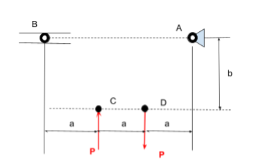
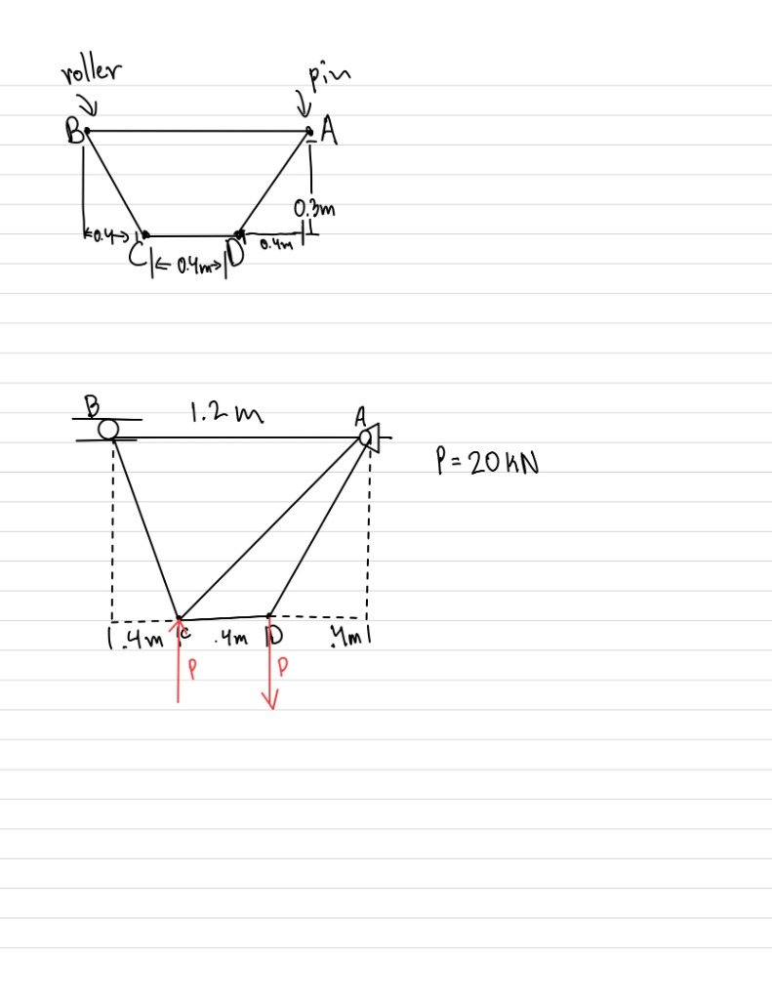
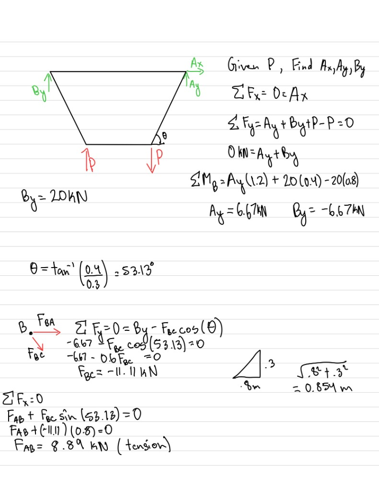
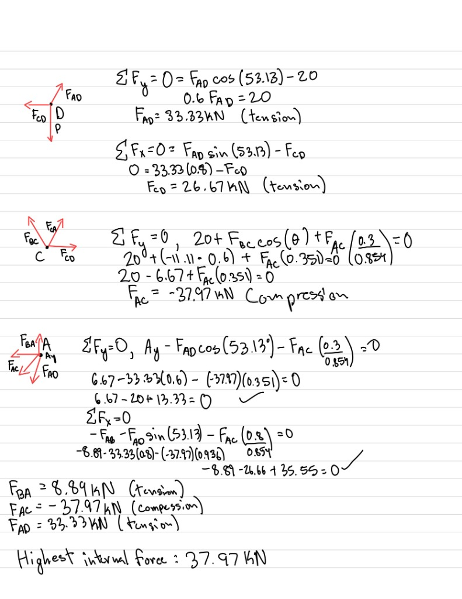
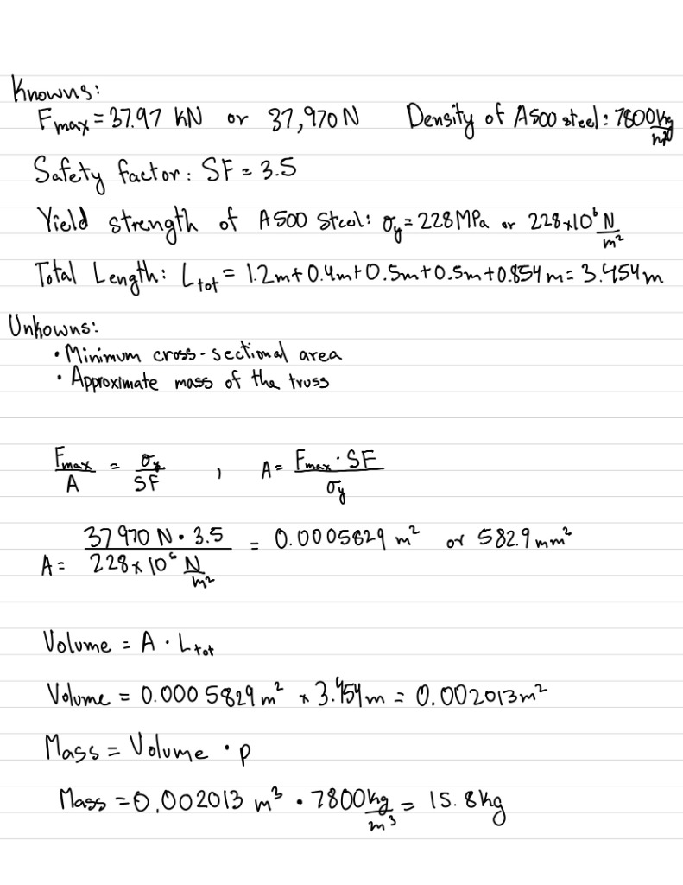
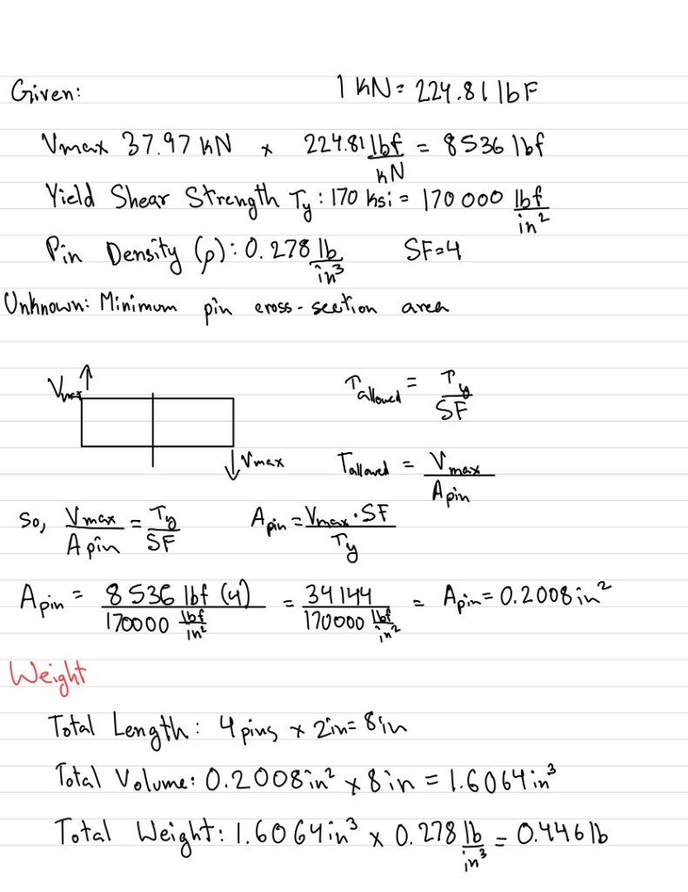
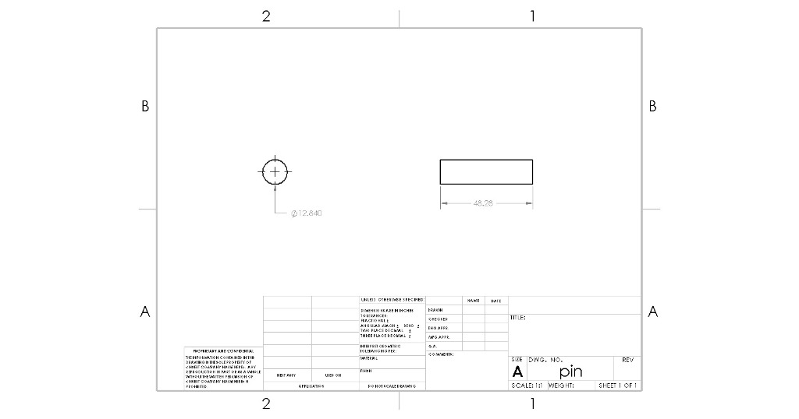
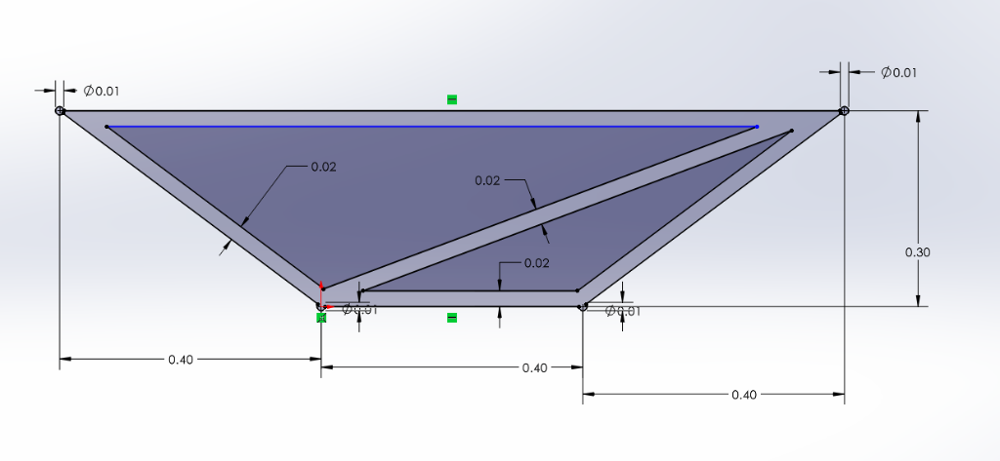

# MEGR 2156 Assignment 2: Truss Stress

## 1. Primary Objective & Truss Design Concept

**Primary Objective:**
The main goal for this project was to design a lightweight planar truss out of A500 steel that could handle two opposing 20 kN point loads (one pushing up at C, and one pulling down at D). We had to make sure it satisfied the specific spatial constraints defined in the assignment prompt (a = 0.4 m, b = 0.3 m).

**Thinking Process & Geometry Layout:**
To get started, I mapped out the required nodes from the prompt: A for the pin, B for the roller, and C and D for the loads. I wanted to keep the design as simple and light as possible, so I checked the static determinacy equation (m + r = 2j). Since we had 4 joints (j=4) and 3 reaction forces (r=3), I knew I needed exactly 5 members (m=5) to keep it rigid without over-complicating things. 

I decided to connect the outer perimeter (AB, BC, CD, AD) and just run a single internal diagonal member (AC) to keep the frame from collapsing. This setup kept the weight down but still fully supported that heavy twisting moment caused by the loads at C and D.

---

## 2. Static Analysis & Internal Forces (Phase 1)

Before I could size any of the steel members, I needed to figure out exactly how much force was running through the truss. I started by finding the global reactions using basic static equilibrium equations, and then worked through the Method of Joints to find the tension and compression in every single piece. It turned out that the diagonal member AC was taking the biggest hit—so that compressive force became the driving factor for the rest of my design.

**Internal Force Summary:**

* **F_AD:** 33.33 kN (Tension)
* **F_CD:** 26.67 kN (Tension)
* **F_BC:** -11.11 kN (Compression)
* **F_AB:** 8.89 kN (Tension)
* **F_AC:** -37.97 kN (Compression) <-- **Maximum Internal Force**

---

## 3. Truss Structure Sizing (Phase 2)

Once I knew the maximum internal force, I could finally size the A500 steel members so they wouldn't fail under the load. The assignment required a safety factor of 3.5, so I divided the steel's yield strength by that factor to find my minimum cross-sectional area. From there, it was pretty straightforward to estimate the total weight of the truss—I just took that required area and multiplied it by the total centerline length of all five members combined.

**Knowns:**

* Maximum Internal Force (F_max): 37.97 kN (or 37,970 N)
* Safety Factor (SF): 3.5
* Yield Strength of A500 Steel (sigma_y): 228 MPa (228 x 10^6 N/m^2)
* Total Length (L_tot): 1.2m + 0.4m + 0.5m + 0.5m + 0.854m = 3.454 m
* Density of A500 Steel (rho): 7800 kg/m^3

**Unknowns:**

* Minimum cross-sectional area (A)
* Approximate mass of the truss

**Results:**

* **Minimum Area (A):** 0.0005829 m^2 (or 582.9 mm^2)
* **Approximate Mass:** 15.8 kg

---

## 4. Connecting Pin Sizing (Phase 3)

For the joints, I used hardened tool steel pins to make sure they could handle the shear forces without snapping. I assumed a basic single-shear connection and applied a safety factor of 4 against the maximum internal force to find the required pin area. After doing the math to get the diameter, I figured out the total pin weight by assuming the wall bracket would be the exact same thickness as the truss members.

**Knowns:**

* Maximum Shear Force (V_max): 37.97 kN x 224.81 = 8,536 lbf
* Yield Shear Strength (tau_y): 170 ksi (170,000 lbf/in^2)
* Pin Density (rho): 0.278 lb/in^3
* Safety Factor (SF): 4
* Connection Type: Single Shear

**Unknowns:**

* Minimum pin cross-sectional area (A_pin)
* Approximate combined weight of the pins

**Results & CAD Dimension Derivations:**

* **Minimum Pin Area (A_pin):** 0.2008 in^2 (diameter of ~12.84 mm)
* **Approximate Pin Weight:** 0.446 lbs

**Step 1: Calculate Minimum Required Area**

The area is derived from the maximum internal shear force (8,536 lbf), the safety factor (4), and the yield shear strength of the tool steel (170,000 psi).

A_pin = (V_max * SF) / tau_y
A_pin = (8,536 lbf * 4) / 170,000 psi
A_pin = 0.2008 in^2

Convert the area from square inches to square millimeters to match the metric CAD environment:
0.2008 in^2 * (25.4 mm / 1 in)^2 = **129.5 mm^2**

**Step 2: Solve for Pin Diameter**

Because pins are cylindrical, I used the area of a circle equation to solve for the radius, and then just doubled it for the CAD diameter dimension.

Area = pi * r^2
129.5 mm^2 = pi * r^2
r^2 = 129.5 / pi = 41.22 mm^2
r = sqrt(41.22) = 6.42 mm
d = 2r = 2(6.42) = **12.84 mm**

**Step 3: Calculate Pin Length**

The assignment specifies a single-shear connection, which means the CAD extrusion has to be long enough to pass entirely through the solid truss member and into the mounting plate (gusset) behind it. To establish a defined length for the volume calculation, I assumed the mounting plate was identical in thickness to the A500 truss member (24.14 mm).

L_pin = Truss Thickness + Gusset Thickness
L_pin = 24.14 mm + 24.14 mm
L_pin = 48.28 mm

---

## 5. CAD Verification (Phase 4)

To double-check my hand calculations, I jumped into SolidWorks and built a 3D model using the exact dimensions I just solved for. I modeled the truss as a single merged part with a solid 24.14 mm square profile, and extruded the pins as separate cylinders. Once the model was laid out, I pulled up the mass properties tool to see how the physical CAD weight compared to my theoretical math.

* **Calculated 1D Theoretical Mass:** 15.8 kg
* **Verified 3D CAD Mass:** 14.41 kg

---

## 6. Lessons Learned & Mistakes Log

This assignment really opened my eyes to how a single bad assumption can throw off an entire engineering design. Early on, I accidentally assumed the 20 kN load at node C was pointing down instead of up; fixing that one flipped arrow completely changed how the internal forces were distributed across the whole truss. I also learned a lot about the difference between theoretical math and physical reality. My hand-calculated mass (15.8 kg) came out noticeably heavier than the CAD mass (14.41 kg) because the 1D math double-counts the steel where the beams overlap at the joints, while the 3D CAD model actually merges those volumes together.

---

## 7. MEGR 2157: Failure Modes Analysis

### Part 1 - Truss Members

* **Expected Failure Mode:** For the truss members, the expected failure mode really just depends on the direction of the load. The tension members (AB, AD, CD) will likely fail via **yielding**, meaning they'll elongate permanently once the normal stress exceeds the 228 MPa limit. On the flip side, the compression members (BC, AC) will fail via **Euler buckling** long before the material reaches its compressive yield limit, simply because long, slender structural elements become geometrically unstable under high compressive loads.
* **Material Classification:** A500 structural steel is a **ductile** material. This means it will experience significant plastic deformation (stretching or bending) before it actually snaps or fractures.
* **Support & Reasoning:** In mechanics of materials, tensile stress is uniformly distributed across the cross-section (sigma = F/A), making yielding the primary concern. Compressive stress, however, introduces lateral deflection risks. Compressive stability relies heavily on the area moment of inertia (I), not just the raw cross-sectional area.
* **Design Modification:** To reduce the likelihood of buckling in the compression members without adding excessive weight, I'd propose changing the cross-sectional geometry from a solid square rod to a hollow square tube. This moves the material further from the neutral axis, massively increasing the area moment of inertia while maintaining the exact same cross-sectional area.

### Part 2 - Pin Connections

* **Expected Failure Mode:** The pins are most likely to fail via **transverse shear fracture**. Alternatively, the connection could fail via bearing yielding (where the much harder tool steel pin elongates and crushes the softer A500 steel pinhole).
* **Support & Reasoning:** According to the Machinery's Handbook (Working Stress section), pins in a single-shear configuration experience the entire 8,536 lbf internal load concentrated entirely across one microscopic slip plane at the interface between the two connected members. Because hardened tool steel is brittle, it won't deform plastically to absorb energy; if the ultimate shear strength is exceeded, it will just snap cleanly at that shear plane.
* **Design Modification:** The best way to fix this would be to redesign the joint from a single-shear connection to a **double-shear connection**. By placing the truss member inside a clevis bracket or sandwiching it between two welded gusset plates, the shear force is perfectly split across two distinct shear planes on the pin. This immediately halves the applied shear stress (tau = F/2A) without requiring a larger, heavier pin.
