# A3 - Parametric Design and Finite Element Analysis

Rick Bhattacharya  
MEGR 2156  
SolidWorks  
Time spent: approximately 5 hours

## Objective

The purpose of this assignment was to design a circular aluminum bar under direct tension. The bar had to carry a load between 300 and 500 lbf while keeping its axial deflection at or below 0.009 in. I used a hand calculation to determine the length, created a parametric model in SolidWorks, and checked the design with finite element analysis.

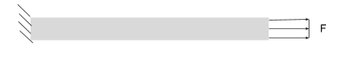

*Figure 1. Basic loading condition for the aluminum bar.*

I chose the following values:

- Force, F = 400 lbf
- Diameter, D = 0.250 in
- Maximum deflection, δ = 0.009 in
- Elastic modulus for the hand calculation, E = 10,000,000 psi
- Material in SolidWorks: Aluminum 6061-T6
- Yield strength given by the assignment: 40 ksi

## Hand Calculations

I first calculated the area of the circular cross section:

**A = πD²/4**

**A = π(0.250 in)²/4 = 0.0490874 in²**

I then used the axial-deflection equation and solved it for length:

**δ = FL/(AE)**

**L = δAE/F**

**L = (0.009 in)(0.0490874 in²)(10,000,000 psi)/(400 lbf)**

**L = 11.0447 in**

Using an approximate aluminum weight density of 0.0975 lbf/in³:

**W = γAL**

**W = (0.0975)(0.0490874)(11.0447) = 0.05286 lbf**

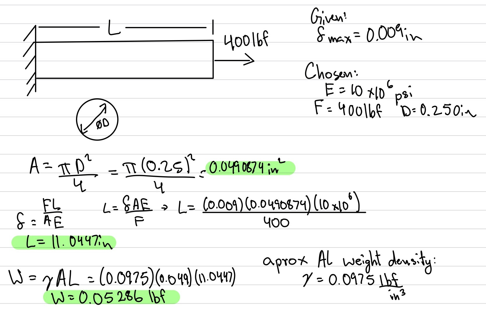

*Figure 2. My original hand calculations for the bar geometry and weight.*

The hand-calculated axial deformation is found by substituting the final dimensions back into the original equation:

**δhand = FL/(AE)**

**δhand = (400)(11.0447)/[(0.0490874)(10,000,000)]**

**δhand = 0.009000 in**

This equals the maximum allowable deflection because the given 0.009 in value was used to determine the bar length.

## Parametric CAD Model

I started by sketching a circle with a diameter of 0.250 in.

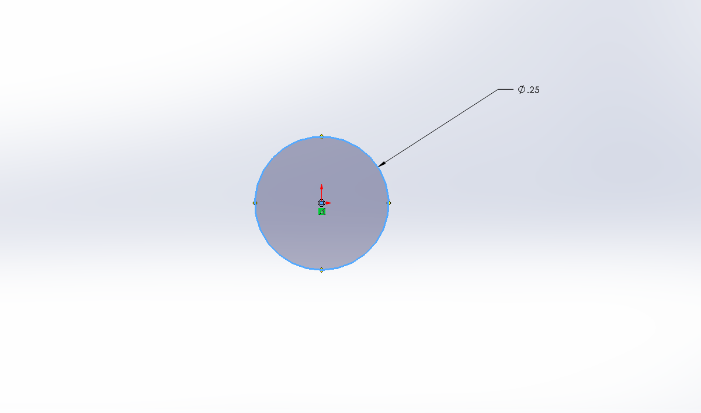

*Figure 3. Circular cross section of the bar.*

I extruded the circle using the length from my hand calculation.

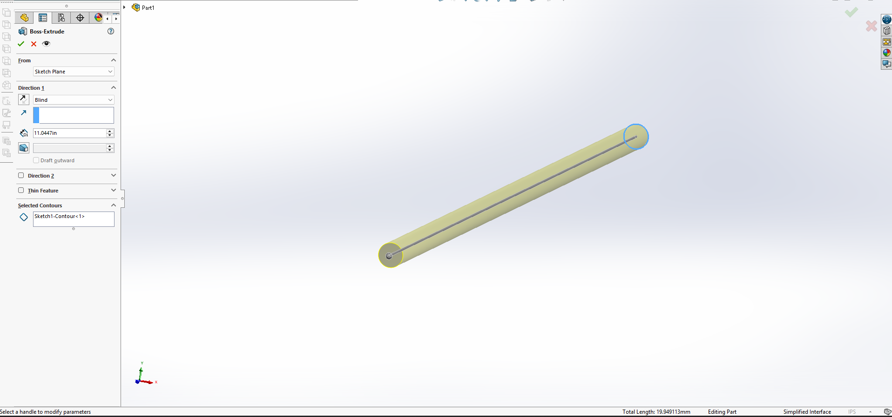

*Figure 4. Initial bar extrusion with a length of 11.0447 in.*

Next, I entered the diameter, area, allowable deflection, modulus, load, and length as global variables in SolidWorks. The area was defined by **A = πD²/4**, and the length was defined by **L = δAE/F**.

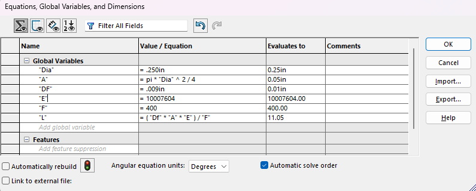

*Figure 5. Parametric equations used to control the bar dimensions.*

The equation table uses the SolidWorks material modulus of 10,007,604 psi, so it evaluates the length to about 11.0531 in, displayed as 11.05. My original extrusion used the rounded modulus of 10,000,000 psi and produced 11.0447 in. This small difference in modulus is discussed in the FEA comparison.

## Material Selection

I selected Aluminum 6061-T6 and used a linear elastic isotropic material model. SolidWorks listed an elastic modulus of 10,007,604 psi, a Poisson's ratio of 0.33, and a yield strength of 39,885.38 psi. The assignment specifies a yield strength of 40 ksi, which is nearly the same as the library value.

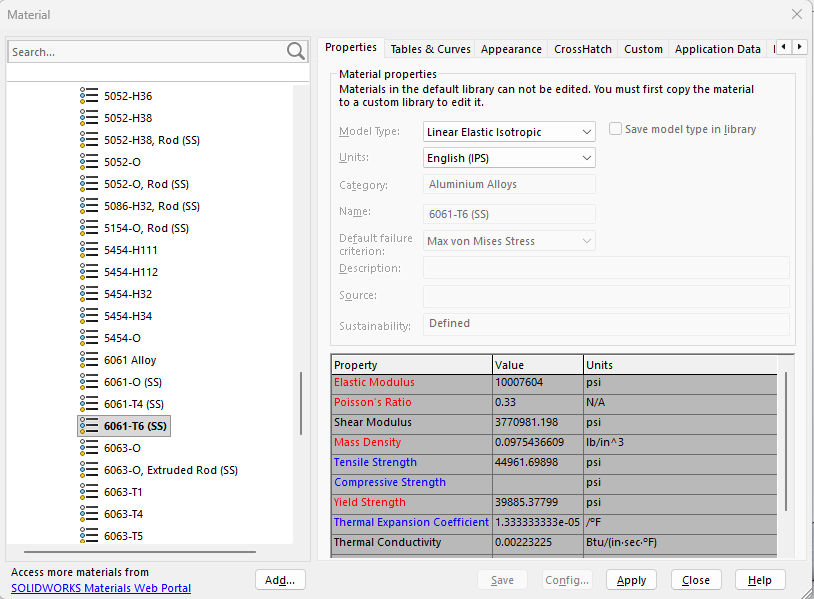

*Figure 6. Aluminum 6061-T6 material properties used in the simulation.*

## FEA Setup

I created a static study. One circular end face was fixed, and a tensile force of 400 lbf was applied to the opposite circular face.

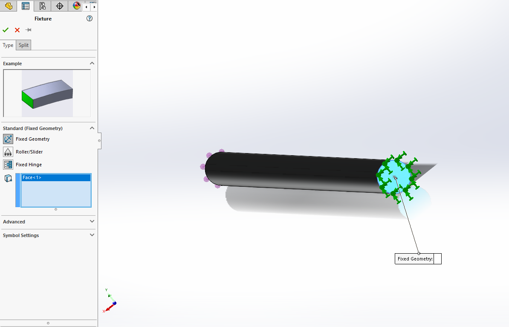

*Figure 7. Fixed geometry applied to one end of the bar.*

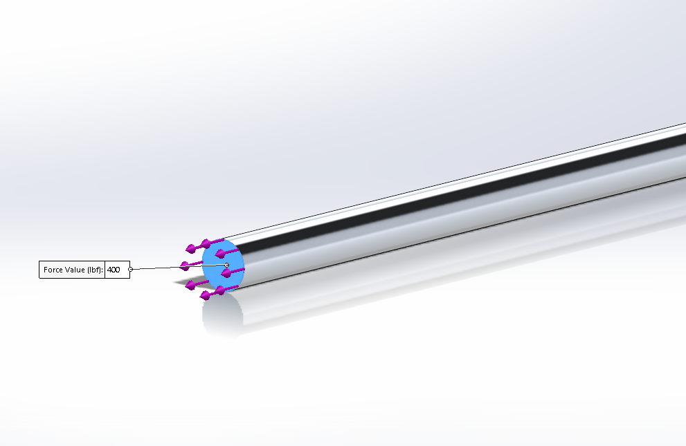

*Figure 8. The 400 lbf tensile force applied to the free end.*

I then created a solid finite element mesh and ran the static study.

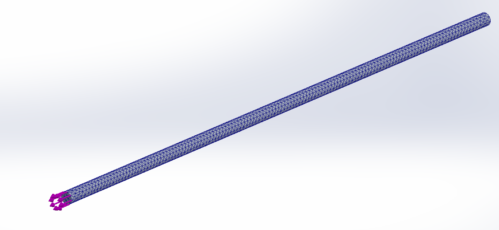

*Figure 9. Solid mesh used for the FEA.*

## FEA Results

### Displacement Map

The maximum resultant displacement, URES, was **8.990 × 10⁻³ in**, which is **0.008990 in**. The minimum was essentially zero at the fixed end. The displacement increased from the fixed end toward the loaded end, which agrees with the expected behavior of a bar in tension.

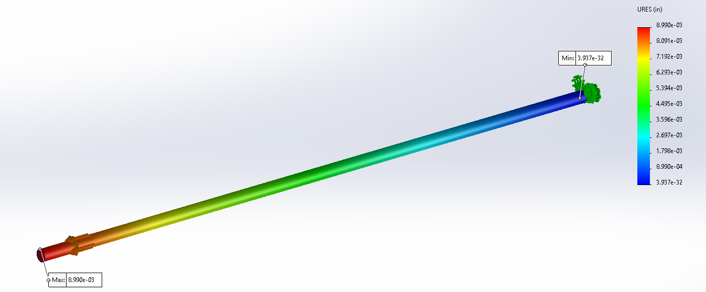

*Figure 10. Resultant displacement map. Maximum URES = 0.008990 in.*

### Von Mises Stress Map

The maximum von Mises stress was **8.720 ksi**. This value is lower than the 40 ksi yield strength given in the assignment.

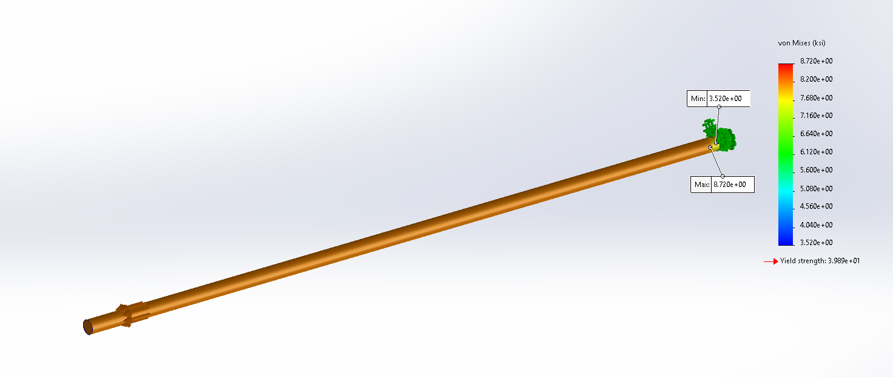

*Figure 11. Von Mises stress map. Maximum stress = 8.720 ksi.*

The safety factor is:

**n = Sy/σmax**

**n = 40 ksi/8.720 ksi = 4.59**

Therefore, the bar passes the yield-strength check.

## Hand Calculation and FEA Comparison

The hand-calculated axial deformation was 0.009000 in. The maximum URES from SolidWorks was 0.008990 in.

**Percent difference = |FEA - hand|/hand × 100**

**Percent difference = |0.008990 - 0.009000|/0.009000 × 100**

**Percent difference = 0.111%**

The values are very close because the bar has a uniform circular cross section and is loaded directly along its axis. The small difference can be caused by the mesh, the fixed-end boundary condition, and the small difference between the modulus used by hand and the modulus in SolidWorks.

For the overall elongation, I trust the hand calculation because the bar closely matches the assumptions of the axial-deformation equation. The FEA is still useful because it shows the displacement and stress distribution throughout the model.

## Hypothetical Pin Hole

The assignment asks for an estimate of the stress around a substantial hole without performing another FEA. I used a flat-bar approximation with a bar width of 0.250 in and a hole diameter of 0.125 in.

**d/w = 0.125/0.250 = 0.50**

Using the Peterson relation for a centered circular hole in a flat bar:

**Kt = 3 - 3.14(d/w) + 3.667(d/w)² - 1.527(d/w)³**

**Kt = 3 - 3.14(0.50) + 3.667(0.50)² - 1.527(0.50)³**

**Kt = 2.156**

The nominal stress was estimated from the load and area:

**σnom = F/A = 400/0.0490874 = 8.149 ksi**

Because this Peterson factor uses the net section:

**σnet = 8.149/(1 - 0.50) = 16.298 ksi**

**σpeak = Ktσnet = (2.156)(16.298) = 35.136 ksi**

**nhole = 40/35.136 = 1.14**

The estimated peak stress is below the 40 ksi yield strength, but the safety factor falls from 4.59 to approximately 1.14. Therefore, the hole would not maintain the original safety factor. This is only a flat-bar approximation because the original design is a circular bar.

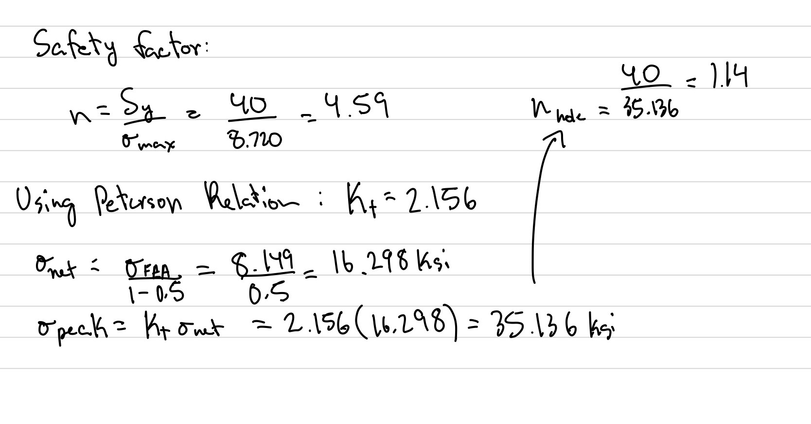

*Figure 12. My handwritten safety-factor and hole calculations.*

## Modify Design Parameters

The equation **L = δAE/F** shows the expected trends. Increasing the load decreases the allowable length, while increasing the cross-sectional area increases the allowable length.

For example, changing the load from 400 lbf to 450 lbf gives:

**L = (0.009)(0.0490874)(10,000,000)/450 = 9.8175 in**

Changing the circular diameter from 0.250 in to 0.300 in gives:

**A = π(0.300)²/4 = 0.0706858 in²**

**L = (0.009)(0.0706858)(10,000,000)/400 = 15.9043 in**

These values show the expected trends, but screenshots and FEA results for the changed-parameter cases have not yet been added. The instructions also mention changing width, height, and thickness even though the assigned bar has a solid circular cross section. A solid circular bar only has one independent cross-sectional dimension, its diameter, so this part should be clarified with the instructor.

## Lessons Learned

This assignment helped me understand how load, area, modulus of elasticity, length, and deflection are related. I learned that the 0.009 in value is an allowable input used to calculate the length, while the FEA displacement is a result that must be compared with it.

I also learned to pay close attention to units. A load of 400 lbf is approximately 1,779 N, so entering 400 N would have applied the wrong load. The assignment's 40 ksi value is the material yield strength, while the 8.720 ksi value is the maximum stress calculated by FEA.

Another issue was the small difference between the elastic modulus used in my hand calculation and the value in the SolidWorks material library. This slightly changes the calculated length and helps explain part of the difference between the hand calculation and FEA result.

The total time spent on the assignment was approximately **5 hours**.

## CAD File

The native SolidWorks `.SLDPRT` file will be added here when available. The assignment requires a working CAD download link.

## References

1. MEGR 2156 Assignment 3 instructions.
2. [Kaiser Aluminum 6061 rod and bar technical data](https://online.kaiseraluminum.com/depot/PublicProductInformation/Document/1025/Kaiser_Aluminum_6061_Rod_and_Bar.pdf).
3. [Ansys example reproducing the Peterson hole relation](https://mapdl.docs.pyansys.com/version/stable/examples/gallery_examples/00-mapdl-examples/2d_plate_with_a_hole.html).
4. [SolidWorks global variables documentation](https://help.solidworks.com/2022/english/SolidWorks/sldworks/c_global_variables.htm).
