# Assignment 4: Motor Mount Design

This week's objective was to design a solid motor mount for a Brushed 24V DC Gear Motor. Instead of just modeling a bracket and hoping it holds, the goal was to analytically design the thickness of the bracket using beam bending calculations to ensure it won't yield or deflect too much under the motor's force.

## Reference Specifications & Initial Planning

To start the design, I reviewed the manufacturer's spec sheet for the motor and the provided reference diagrams.

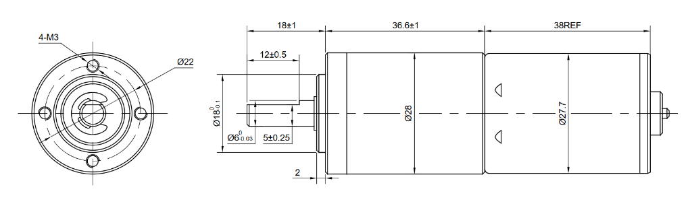
*Motor specification sheet showing the Ø28mm body, Ø18mm front boss, and 4x M3 mounting pattern.*

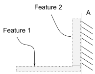
*Reference diagram showing the two main features of the L-bracket mount.*

### Assumptions and Material Selection
To simplify the analysis, I made a few justifiable approximations. I modeled the two plates of the L-bracket as simple cantilever beams. I chose **PLA** for the material, which has a yield strength (S_y) of about 60 MPa and an Elastic Modulus (E) of 3500 MPa. 

I applied a **Safety Factor of 3**. Instead of doing a highly complex stress concentration analysis on the bolt holes, I assumed this conservative safety factor inherently accounts for the stress concentrations caused by the shaft and mounting holes. The maximum allowable deflection was constrained to 0.30 mm, and the applied load (P) from the motor shaft is 300 N.

For the base dimensions, the motor has a 28 mm diameter (14 mm radius). To ensure the motor clears the wall, I set the length of the motor plate to 40 mm. I set the overall width of the bracket to 35 mm to comfortably fit the 22 mm bolt circle.

---

## Feature 1: Motor Plate (Horizontal)

Feature 1 acts as a horizontal cantilever beam. One end is fixed to the vertical wall plate, and the other end takes the 300 N load from the motor.

*[View full uncropped Feature 1 handwritten page](images/full-A4-1.jpg)*

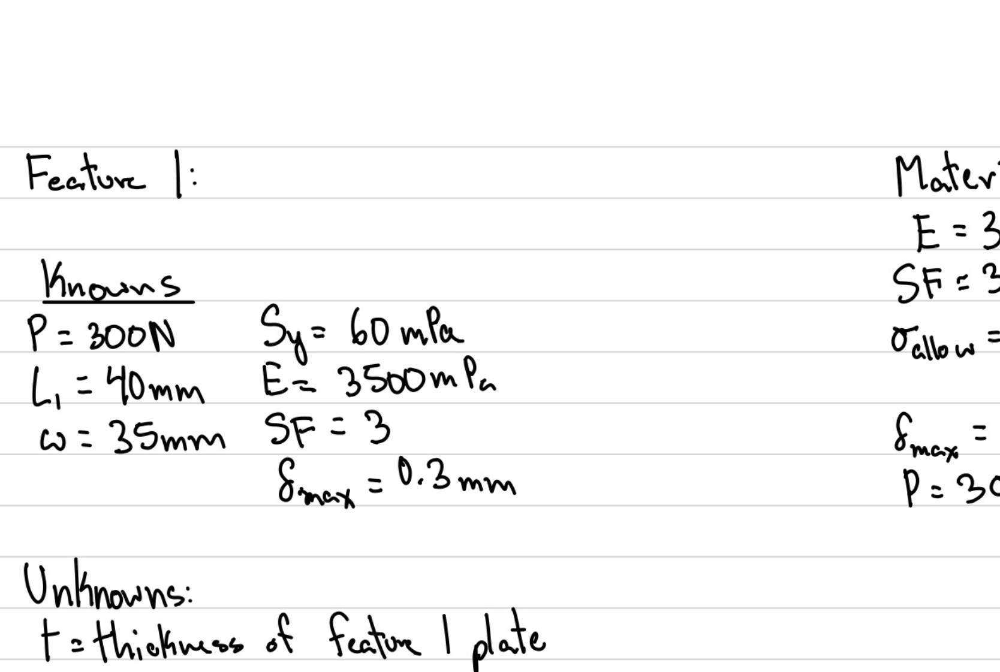

I evaluated this feature for both stress (preventing it from yielding) and deflection (preventing it from bending more than 0.30 mm).

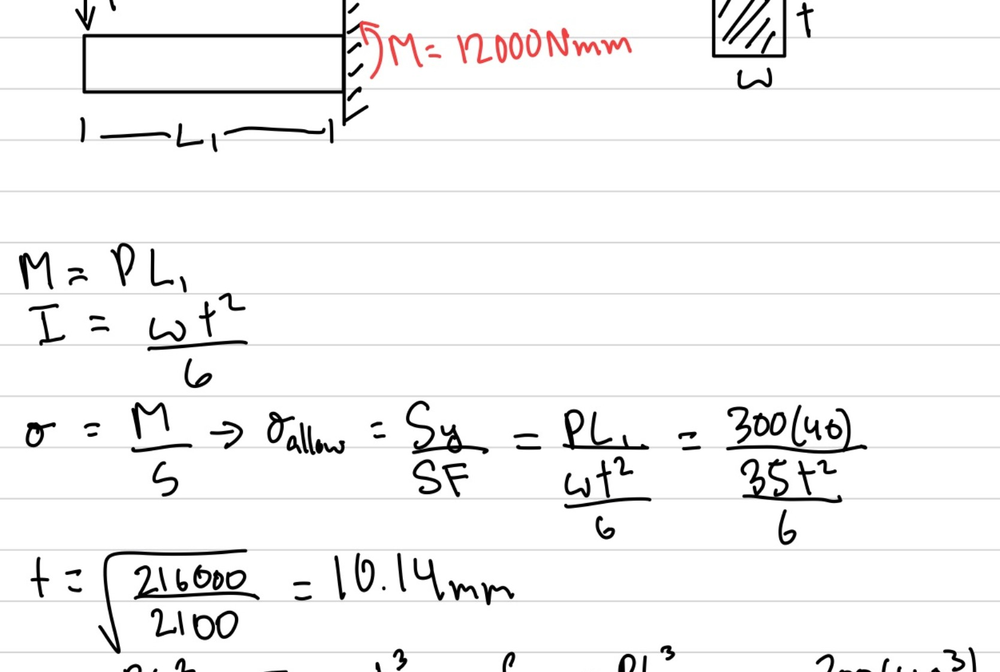

The stress equation dictated a minimum thickness of 10.14 mm, but the deflection equation required 12.78 mm. Because deflection is the limiting factor, it controls the design. I rounded this up to **13 mm** for the final thickness of Feature 1.

---

## Feature 2: Wall Plate (Vertical)

Feature 2 is the vertical plate that mounts the assembly to Wall A. Per the assignment parameters, I assumed that the rigid wall A can fully support the mounting bolts without failure. The motor's load creates a bending moment at the top of this vertical plate where it connects to the wall.

*[View full uncropped Feature 2 handwritten page](images/full-A4-2.jpg)*

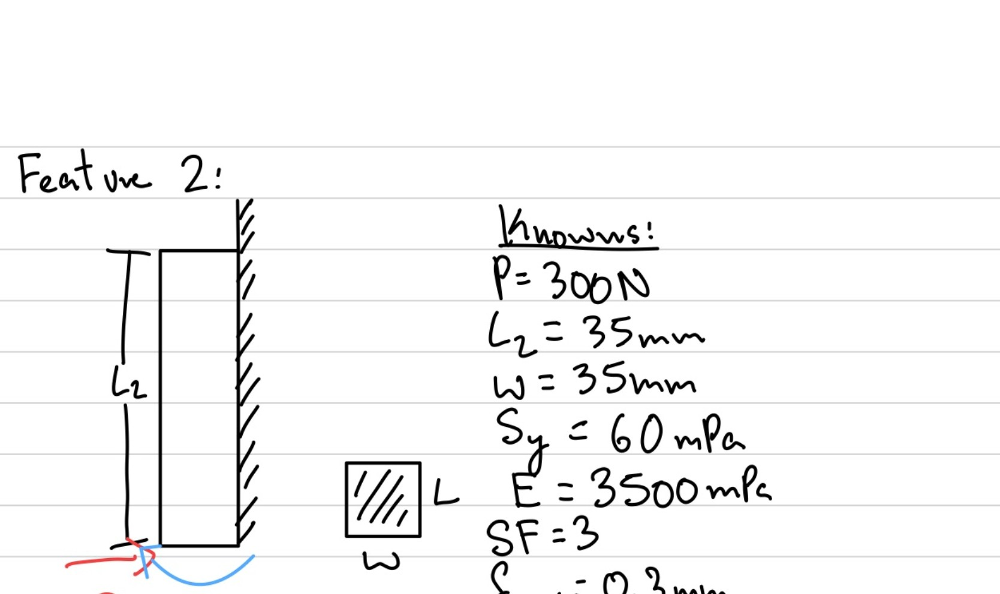

Similar to Feature 1, I ran the beam bending equations for both stress and deflection.

**Design for Stress:**
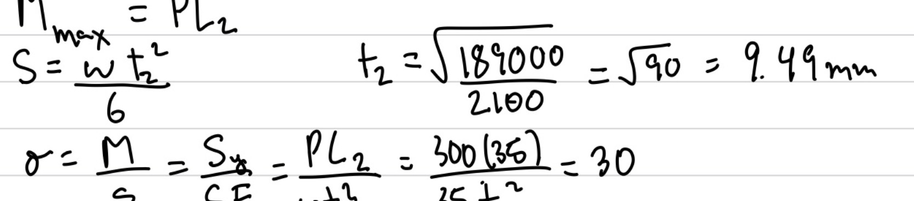

**Design for Deflection:**
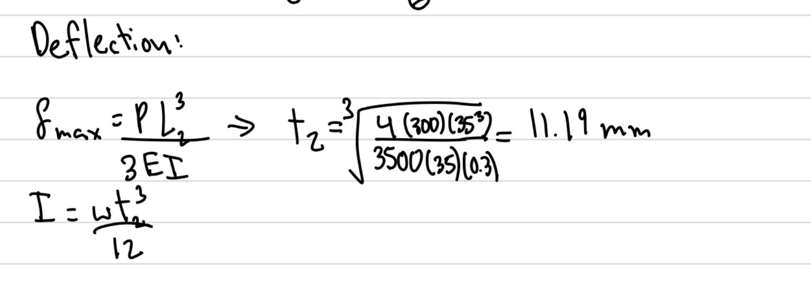

Stress required 9.49 mm, while deflection required 11.19 mm. Once again, deflection controlled the design, so I rounded up to a final thickness of **12 mm** for Feature 2.

---

## Isometric Hand Sketch

With the calculations finished, I sketched out the final dimensions of the L-bracket before moving into SolidWorks.

*[View full uncropped Isometric Sketch page](images/full-A4-3.jpg)*

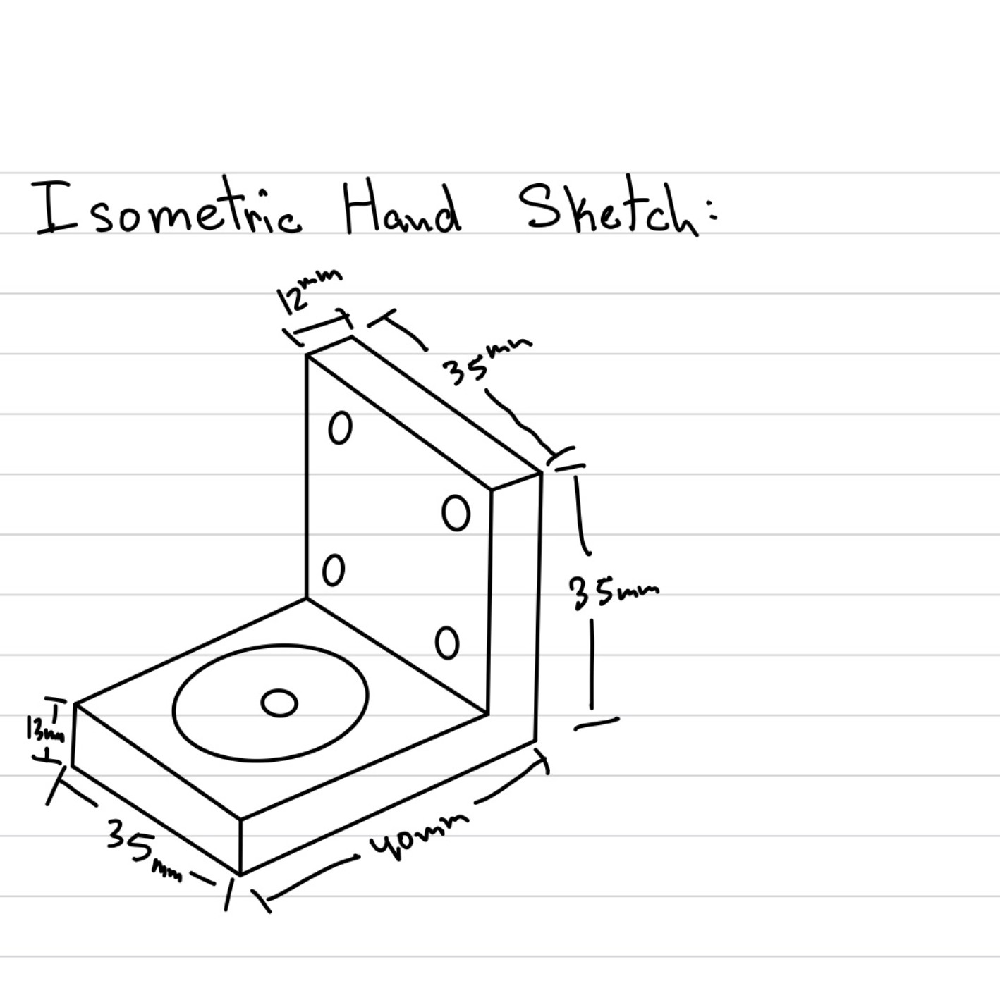

---

## 3D CAD Model (SolidWorks)

### Parametric Modeling
To ensure the design was robust, I used fully parametric modeling techniques. Instead of hard-coding the calculated thicknesses into the sketch, I inputted the actual deflection equations into the SolidWorks Global Variables table. 

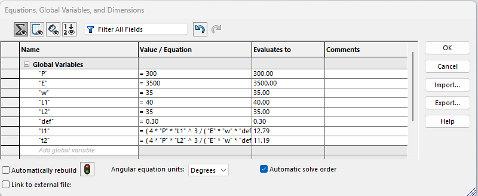
*SolidWorks Equation Manager calculating the 13mm and 12mm thicknesses automatically based on the physics parameters.*

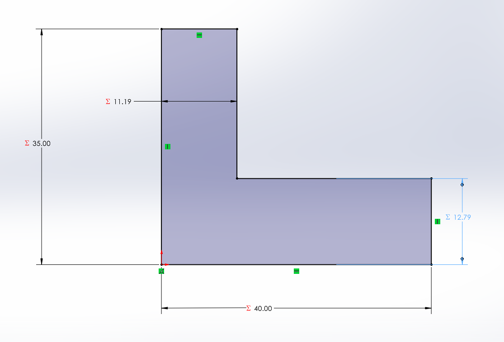
*The base L-bracket sketch driven entirely by global variables.*

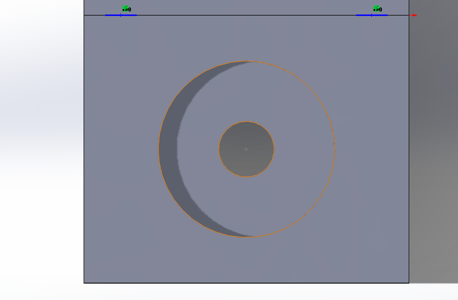
*The base extrusion, which is also parametrically linked to the width variable.*

### Clearance Holes
For the motor mounting face, the motor has a small 18 mm raised boss at the base of the shaft. To ensure the motor sits perfectly flush against the bracket, I cut a 19 mm clearance hole in the center. I then added the four motor mounting holes on a 22 mm bolt circle. The rubric called for 3.4 mm clearance holes for the M3 bolts, which I applied to both the motor face and the wall mounting face.

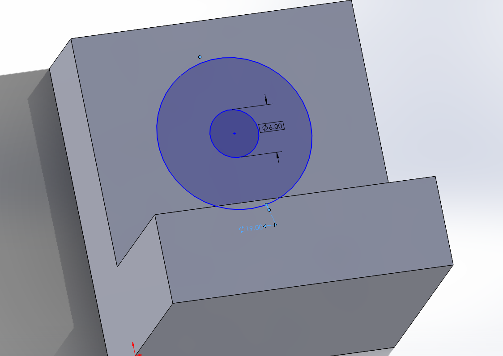
*Center clearance hole (19 mm) and motor bolt holes (3.4 mm).*

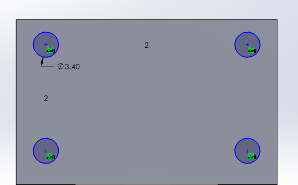
*Wall mounting clearance holes (3.4 mm).*

### Minimizing Deflection
A standard 90-degree internal corner on an L-bracket is highly susceptible to bending and acts as a massive stress concentrator. To reinforce this joint and minimize deflection, I added an internal chamfer feature connecting the two plates.

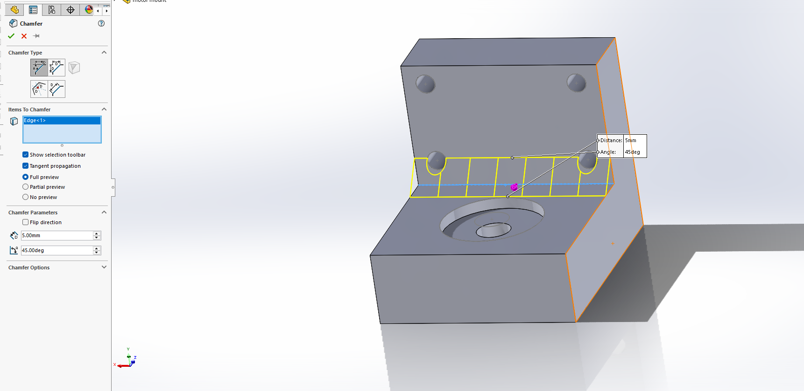
*Internal chamfer added to reinforce the corner and minimize deflection.*

### Final CAD Result
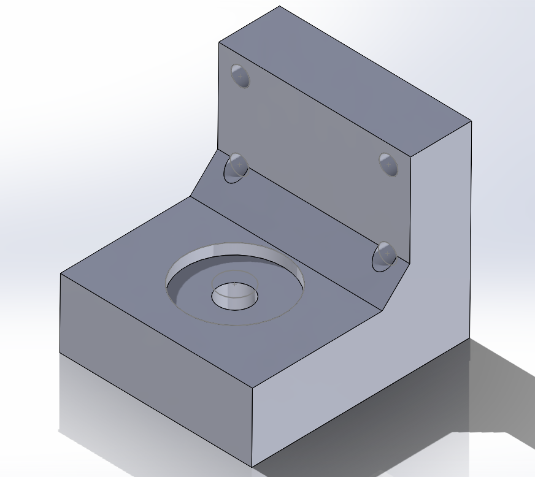

**[Download MotorMount.SLDPRT](cad/motor-mount.SLDPRT)**

---

## Multiview Drawing (MEGR 2157)

I created a formal engineering drawing of the motor mount using ASME standard conventions and third-angle projection. The sheet includes the Front, Top, and Right Side views perfectly aligned, with the Isometric view placed in the upper right. The title block is properly filled out with the scale and PLA material callout.

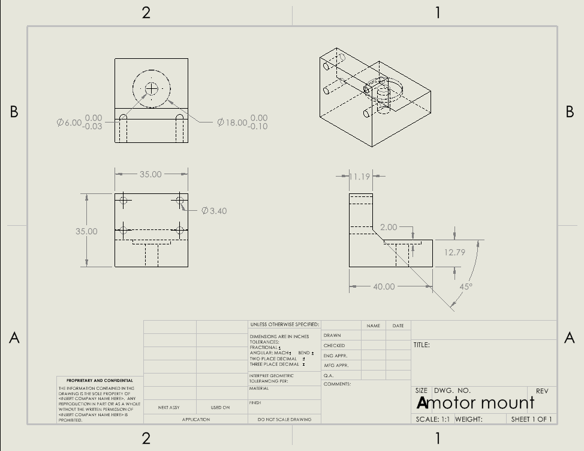

**[Download PDF Drawing](cad/motor-mount-drawing.pdf)**

