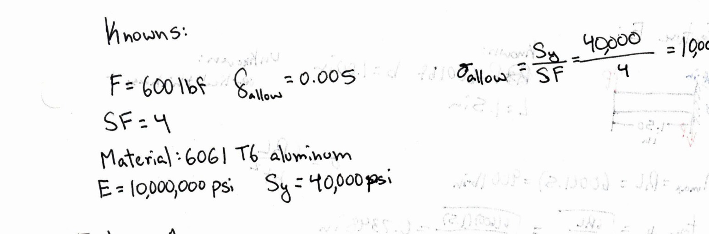
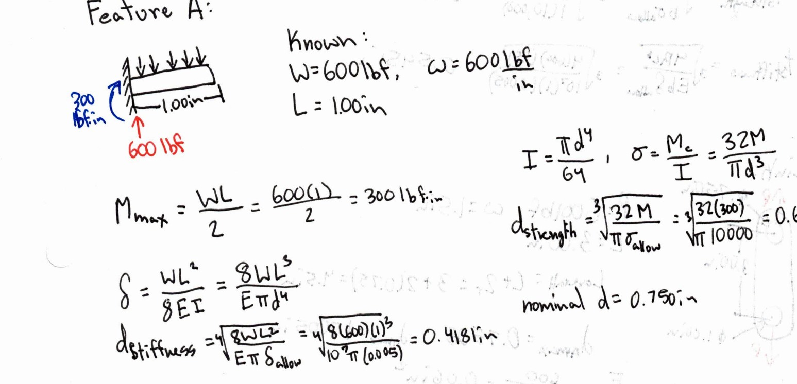
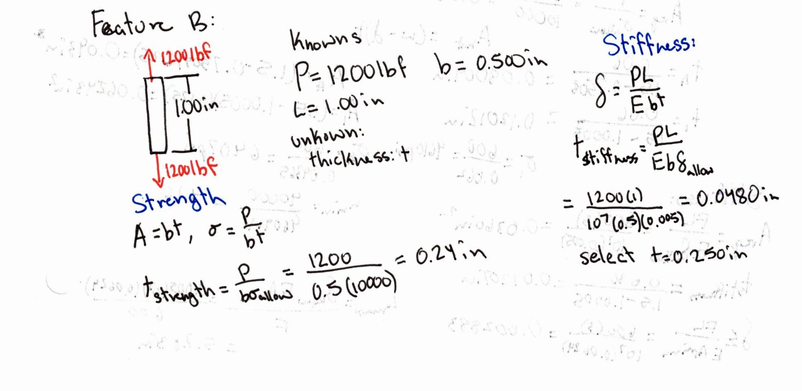
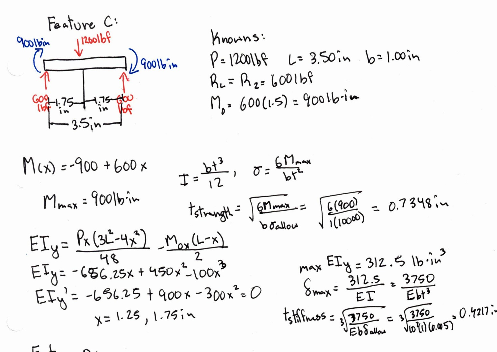
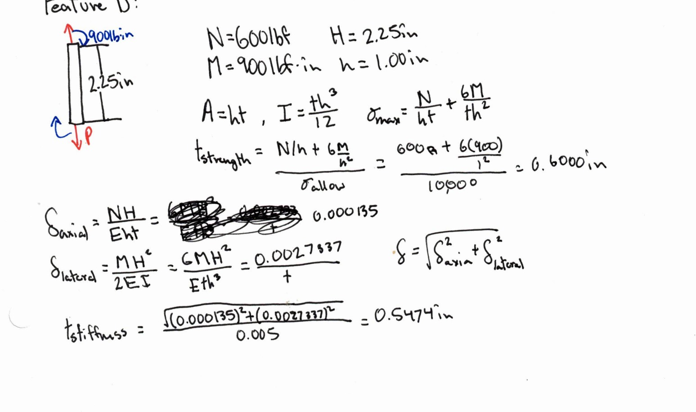
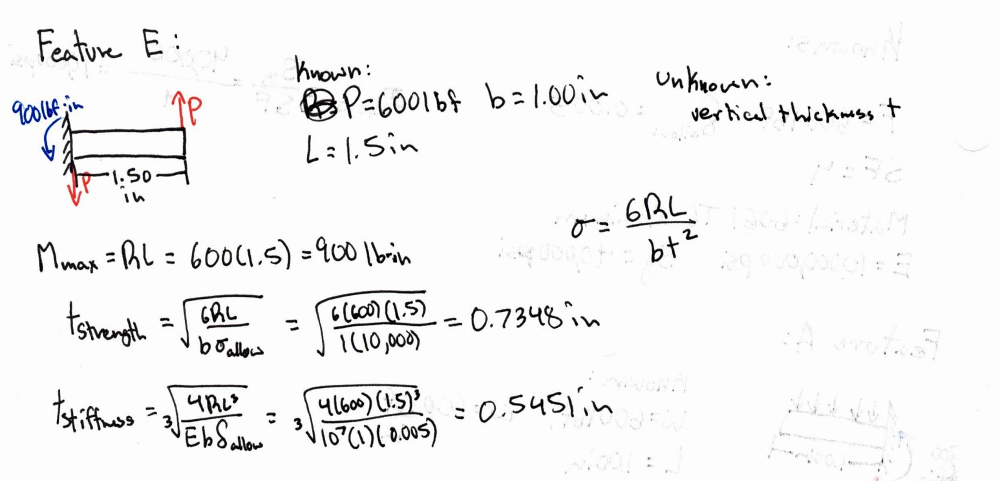
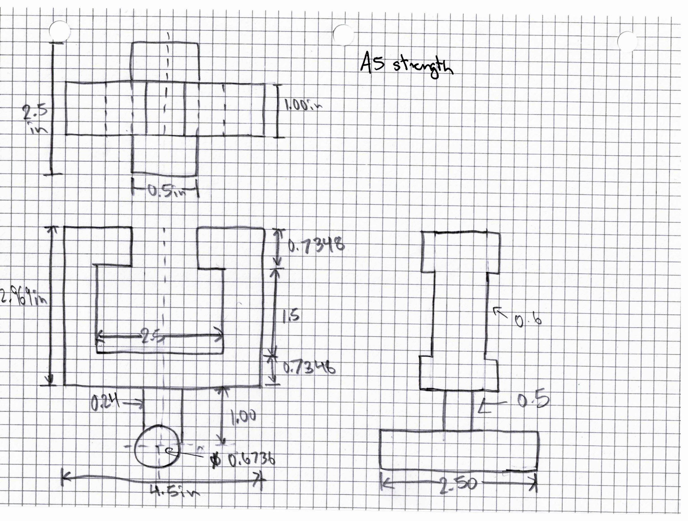
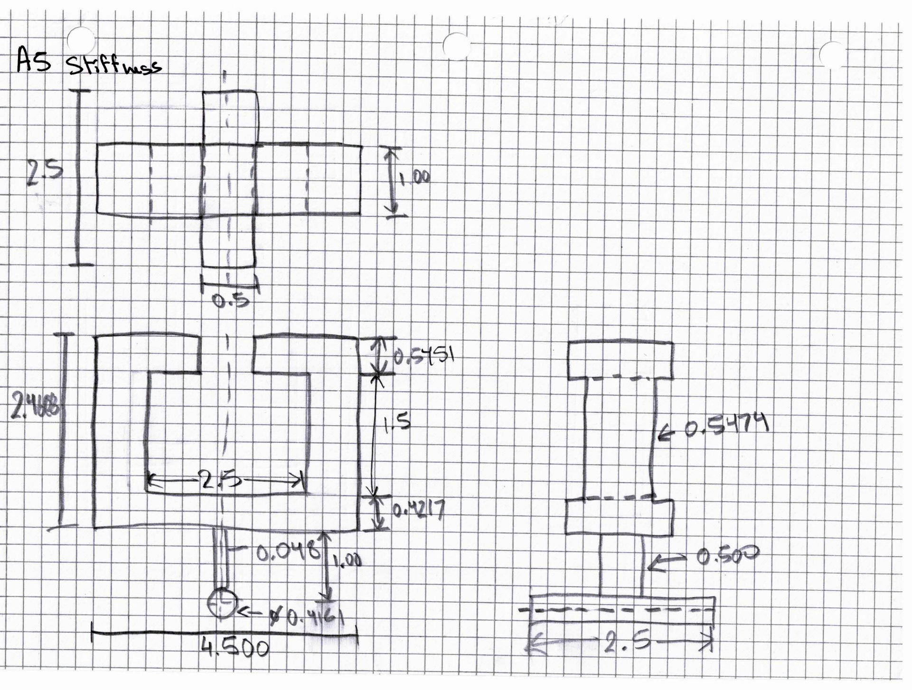
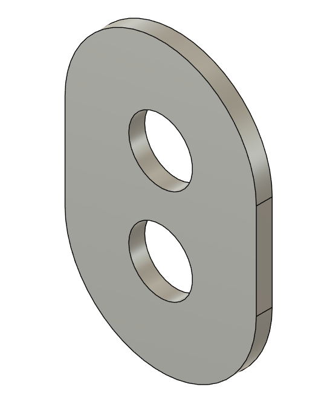
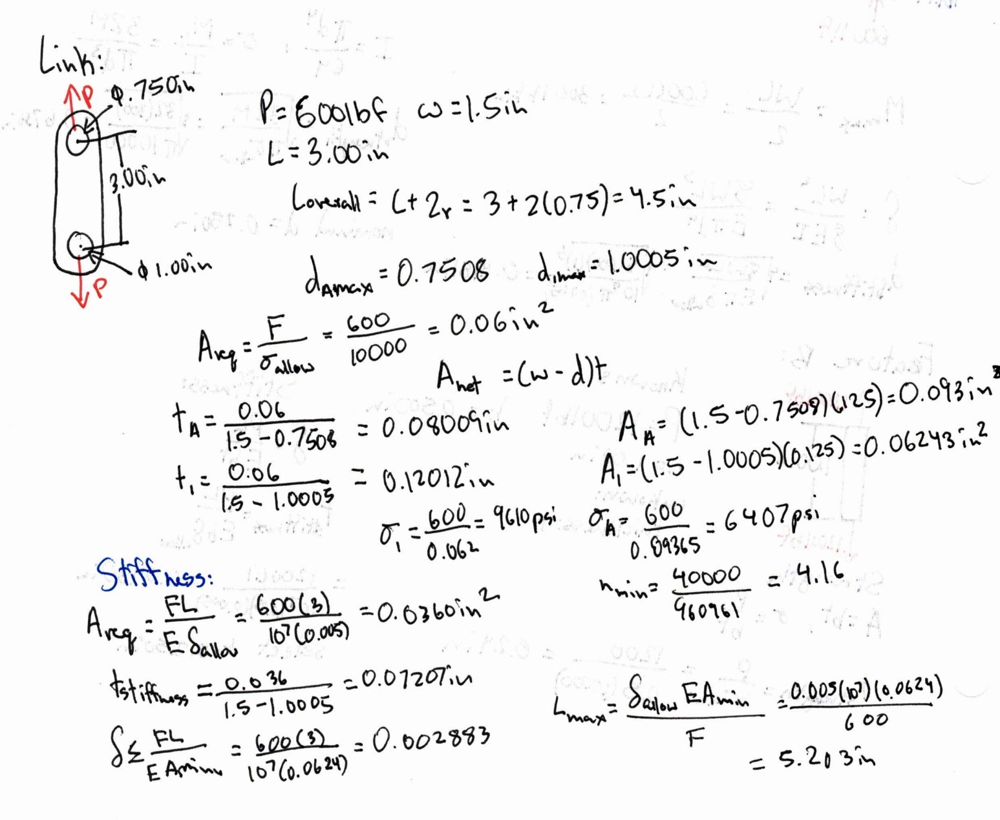

# A5 - Design for Strength and Stiffness I

Rick Bhattacharya  
MEGR 2157  
Time spent: approximately **5 hours**

[Download the submission PDF](files/A05-submission.pdf)

**Trouble reading the formatting? [View all original handwritten work](files/A05-original-work.pdf)** — full-page calculations and both drawings. The same scans are included at the end of the submission PDF, with a clickable link to them.

## Objective and design decisions

Design a bracket using five strength analyses and five stiffness analyses, then design the additional MEGR 2157 linkage and its fits. Each feature must meet a safety factor of 4 and a local deflection limit of 0.005 in. This report follows the updated assignment, which requires two paper multiview sketches and a PDF submission; it does not require CAD files.

I chose a symmetric bracket with a centered connector B and two opposite pin overhangs A. Each strap leg applies 600 lbf, so the bracket carries 1,200 lbf total. The linkage case replaces the strap with two identical links, each carrying 600 lbf. These are alternative load cases, not simultaneous loads.

<figure class="a5-figure a5-reference"><figcaption>Assignment-provided A–E feature diagram. My design uses a centered B connector with symmetric pin overhangs. <a href="images/assignment-bracket.png">Full size</a>.</figcaption></figure>

The load path is A → B → C → D → E → rigid T-beam. Opposing A moments cancel at B. Each upper lip E carries 600 lbf and transfers a 900 lbf·in moment through its sidewall D into C. Consequently, C includes end couples in addition to the center load suggested in the assignment hint. All sketches use a rotated page orientation for convenience; gravity is neglected.

## Given values, chosen dimensions, and assumptions

| Quantity | Value | Basis |
|---|---:|---|
| Force per strap leg, F | 600 lbf | Chosen within 500 &lt; F &lt; 800 |
| Total bracket force, P | 1,200 lbf | Two symmetric legs |
| Required safety factor | 4 | Assignment |
| Allowable local deformation | 0.005 in | Assignment, each feature |
| Material | Aluminum 6061-T6 | Permitted choice |
| Elastic modulus, E | 10,000,000 psi | Rounded typical property [2] |
| Yield strength, Sᵧ | 40,000 psi | Typical property [2] |
| Allowable normal stress | 10,000 psi | Sᵧ / 4 |

The selected material values are typical reference values for this classroom analysis, not a material certificate. All lengths below are in inches unless otherwise stated.

Assumptions: small linear-elastic deformation, symmetric loading, rigid T-beam, no self-weight, no direct-shear failure, and negligible shear deformation. Each stiffness check measures member deformation relative to its connection; it is not the displacement of the complete flexible frame. Nominal section stresses are used, excluding local fillet/hole stress concentrations and press-fit residual stresses. Connections transfer the forces and moments specified in the calculations below. The handwritten FBDs appear within my scanned work; arrow-direction corrections are recorded in the review notes.

**Common calculation:** σallow = Sᵧ / SF = 40,000 / 4 = **10,000 psi**.

<figure class="a5-figure"><figcaption>Original handwritten inputs. The typed values above restore text clipped at the scan edge. <a href="images/hand-given.jpg">Full size</a>.</figcaption></figure>

## A - Pin overhang: strength and stiffness

**Known:** W = 600 lbf per overhang, L = 1.000, w = W/L = 600 lbf/in. **Unknown:** diameter d from strength and stiffness. **Assumption:** one fixed-root circular cantilever under uniform strap load; the other overhang is its mirror.

### Strength

R = W = 600 lbf; M = WL/2 = 600(1)/2 = 300 lbf·in. 
I = πd⁴/64; σ = Mc/I = 32M/(πd³). 
dstrength = [32M/(πσallow)]1/3 = [32(300)/(π × 10,000)]1/3 = <strong>0.6736 in</strong>.

### Stiffness

δ = WL³/(8EI) = 8WL³/(Eπd⁴). 
dstiffness = [8WL³/(Eπδallow)]1/4 
= [8(600)(1)³/(10⁷π × 0.005)]1/4 = <strong>0.4181 in</strong>.

Select nominal diameter **0.750 in**; the final RC3 shaft limits are checked below.

<figure class="a5-figure"><figcaption>My handwritten A calculations and FBD. Typed equations and review notes clarify the original arrow direction and clipped text. <a href="images/hand-a.jpg">Full size</a>.</figcaption></figure>

## B - Center connector: strength and stiffness

**Known:** P = 1,200 lbf, L = 1.000, section breadth b = 0.500. **Unknown:** thickness t. **Assumption:** centered axial tension; symmetric A moments cancel.

### Strength

A = bt; σ = P/(bt). 
tstrength = P/(bσallow) = 1,200/(0.500 × 10,000) = <strong>0.2400 in</strong>.

### Stiffness

δ = PL/(Ebt). 
tstiffness = PL/(Ebδallow) = 1,200(1)/(10⁷ × 0.500 × 0.005) = <strong>0.0480 in</strong>.

Select **t = 0.250 in** and b = 0.500 in. In the front view, thickness t is horizontal and b is the depth into the page.

<figure class="a5-figure"><figcaption>Original handwritten B strength and stiffness calculations. <a href="images/hand-b.jpg">Full size</a>.</figcaption></figure>

## C - Bottom crossmember: strength and stiffness

**Known:** center load P = 1,200 lbf; support-center span L = 3.500; depth b = 1.000; end reaction 600 lbf; end-couple magnitude M₀ = 600(1.500) = 900 lbf·in. **Unknown:** vertical thickness t. **Assumption:** simply supported member with the center load and opposite end couples transferred through D. The support model permits end rotation; the applied couples are retained explicitly.

### Strength

For the left half, 0 ≤ x ≤ 1.750: M(x) = −900 + 600x. 
M(0) = −900; M(1.750) = 150; therefore |M|max = 900 lbf·in. 
I = bt³/12; σ = 6|M|max/(bt²). 
tstrength = √[6|M|max/(bσallow)] = √[6(900)/(1 × 10,000)] = <strong>0.7348 in</strong>.

### Stiffness

Taking downward displacement as positive: 
EIy = Px(3L² − 4x²)/48 − M₀x(L − x)/2 
= −656.25x + 450x² − 100x³. 
EIy′ = −656.25 + 900x − 300x² = 0, giving x = 1.250 and 1.750 in. 
Checking those positions and the end gives max |EIy| = 312.5 lbf·in³. 
δmax = 312.5/(EI) = 3,750/(Ebt³). 
tstiffness = [3,750/(Ebδallow)]1/3 = [3,750/(10⁷ × 1 × 0.005)]1/3 = <strong>0.4217 in</strong>.

Select **t = 0.750 in**.

<figure class="a5-figure"><figcaption>Original handwritten C analysis, including the bending-moment and deflection equations. <a href="images/hand-c.jpg">Full size</a>.</figcaption></figure>

## D - Sidewall: strength and stiffness

**Known:** N = 600 lbf, M = 900 lbf·in, centerline height H = 2.250, front-view width h = 1.000. **Unknown:** depth into the page t. **Assumption:** axial tension plus constant bending; local translation is measured relative to the lower connection with its rigid-body motion removed.

### Strength

A = ht; I = th³/12. 
σmax = N/(ht) + 6M/(th²). 
tstrength = (N/h + 6M/h²)/σallow 
= [600/1 + 6(900)/1²]/10,000 = <strong>0.6000 in</strong>.

### Stiffness

δaxial = NH/(Eht) = 0.000135/t. 
δlateral = MH²/(2EI) = 6MH²/(Eth³) = 0.00273375/t. 
δ = √(δaxial² + δlateral²). 
tstiffness = √(0.000135² + 0.00273375²)/0.005 = <strong>0.5474 in</strong>.

Select **t = 1.000 in** to match the depth of C and E. The analysis-only paper sketches use the calculated smaller D depths. Their actual centerline heights are shorter than 2.250 in, so retaining this calculation is conservative for those sketches.

<figure class="a5-figure"><figcaption>Original handwritten D combined-stress and resultant-deformation calculations. <a href="images/hand-d.jpg">Full size</a>.</figcaption></figure>

## E - Upper lip: strength and stiffness

**Known:** reaction R = 600 lbf, effective length L = 1.500 from sidewall centerline to inner tip, depth b = 1.000. **Unknown:** vertical thickness t. **Assumption:** tip-loaded cantilever; placing the T-beam reaction at the inner tip conservatively maximizes its lever arm.

### Strength

M = RL = 600(1.500) = 900 lbf·in. 
σ = 6RL/(bt²). 
tstrength = √[6RL/(bσallow)] = √[6(600)(1.500)/(1 × 10,000)] = <strong>0.7348 in</strong>.

### Stiffness

δ = RL³/(3EI) = 4RL³/(Ebt³). 
tstiffness = [4RL³/(Ebδallow)]1/3 
= [4(600)(1.500)³/(10⁷ × 1 × 0.005)]1/3 = <strong>0.5451 in</strong>.

Select **t = 0.750 in**.

<figure class="a5-figure"><figcaption>Original handwritten E strength and stiffness calculations. <a href="images/hand-e.jpg">Full size</a>.</figcaption></figure>

## Comparison and final design selection

| Sized dimension | Strength result (in) | Stiffness result (in) | Selected dimension (in) |
|---|---:|---:|---:|
| A diameter | 0.6736 | 0.4181 | 0.750 nominal; RC3 limits below |
| B thickness | 0.2400 | 0.0480 | 0.250 |
| C thickness | 0.7348 | 0.4217 | 0.750 |
| D depth | 0.6000 | 0.5474 | 1.000 |
| E thickness | 0.7348 | 0.5451 | 0.750 |

Strength governs all five calculated dimensions. D is the closest comparison: 0.6000 − 0.5474 = 0.0526 in. Values in the calculation sketches are rounded analysis results; they are not manufacturing lower limits. The selected dimensions provide rounding margin.

## Two hand-drawn multiview sketches

These are separate strength-only and stiffness-only sizing sketches, each containing front, top, and right-side views. Neither represents the final combined design by itself. The pin projects 1.000 in on each side of the 0.500-in-deep centered B connector, for a 2.500-in total length.

<figure class="a5-figure"><figcaption>Hand-drawn strength multiview sketch; upper-body height = 1.500 + 0.7348 + 0.7348 = 2.9696 in. <a href="images/drawing-strength.jpg">Full size</a>.</figcaption></figure>
<figure class="a5-figure"><figcaption>Hand-drawn stiffness multiview sketch; upper-body height = 1.500 + 0.4217 + 0.5451 = 2.4668 in. <a href="images/drawing-stiffness.jpg">Full size</a>.</figcaption></figure>

The strength sketch has D centerline height 2.2348 in; the stiffness sketch has 1.9834 in. Both are below the 2.250-in height used in D's original calculation. The stiffness drawing's small B-width label should read **0.0480 in**, consistent with the calculation. Any clipped overall-height label is supplied in the captions. The nominal openings shown on paper are supplemented by the fit limits below.

## T-beam fits: a, b, and c

<figure class="a5-figure a5-reference"><figcaption>Assignment-provided T-beam dimensions and strap loading. <a href="images/assignment-tbeam.png">Full size</a>.</figcaption></figure>

The assignment's supplied external dimensions are a = 0.4970–0.4980, b = 0.9987–0.9992, and c = 1.4980–1.4990 in. The b lower deviation is **−0.0005 in**. Their intended classes are **RC7 free running**, **RC3 precision running**, and **RC4 close running**, respectively.

The selected handbook entries used for both the bracket and linkage are reproduced below as limit deviations in inches. Reference [1], printed pp. 634–635 and 640; table entries originally expressed in thousandths were divided by 1,000.

| Use / class | Basic-size range (in) | Hole/internal deviation (in) | Shaft/external deviation (in) | Table / printed page |
|---|---|---|---|---|
| a / RC7 | Over 0.40 to 0.71 | 0 to +0.0016 | −0.0030 to −0.0020 | 4 / 635 |
| b and link A / RC3 | Over 0.71 to 1.19 | 0 to +0.0008 | −0.0013 to −0.0008 | 3 / 634 |
| c / RC4 | Over 1.19 to 1.97 | 0 to +0.0016 | −0.0020 to −0.0010 | 3 / 634 |
| Link shaft / FN1 | Over 0.95 to 1.19 | 0 to +0.0005 | +0.0008 to +0.0012 | 9 / 640 |

| Mating bracket dimension | Internal limits (in) | Minimum clearance (in) | Maximum clearance (in) |
|---|---|---:|---:|
| Stem slot a | 0.5000–0.5016 | 0.5000 − 0.4980 = 0.0020 | 0.5016 − 0.4970 = 0.0046 |
| Each flange recess b | 1.0000–1.0008 | 1.0000 − 0.9992 = 0.0008 | 1.0008 − 0.9987 = 0.0021 |
| Pocket height c | 1.5000–1.5016 | 1.5000 − 1.4990 = 0.0010 | 1.5016 − 1.4980 = 0.0036 |

The recess b is measured horizontally from the corresponding stem-slot edge to the outer pocket wall. Thus full pocket width = a + 2b = **2.5000–2.5032 in**. With 1.000-in sidewall widths, overall bracket width is 4.5000–4.5032 in. The selected upper-body height is 0.750 + c + 0.750 = 3.0000–3.0016 in. These calculated limits supplement the nominal paper dimensions; no alteration of the supplied T-beam is required.

Manufacturing plan: mill the pocket and stem opening, finish the mating surfaces to the limits above, and inspect with calibrated internal measurements or gauges. Hold the common centerline and symmetric recess locations; size tolerances alone do not define alignment.

### Final selected-member check including fit variation

At maximum opening sizes, use C span = 3.5032, E lever arm = 1.5008, D height = 2.2516, and M = 600(1.5008) = 900.48 lbf·in. At A, use the smallest finished shaft diameter, 0.7487 in. These checks use the selected dimensions, not the smaller analysis-only sketches.

| Feature | Maximum nominal normal stress (psi) | Local deformation (in) | Result |
|---|---:|---:|---|
| A, uniform strap load | 7,281 | 0.000486 | Below both limits |
| B | 9,600 | 0.000960 | Below both limits |
| C, with end couples | 9,605 | 0.000890 | Below both limits |
| D | 6,003 | 0.002742 | Below both limits |
| E | 9,605 | 0.001923 | Below both limits |

The checks use the equations above with the revised lengths. For C, maximizing the same deflection polynomial with L = 3.5032 and M₀ = 900.48 gives the tabulated value. The largest stress is approximately 9,605 psi, giving nominal yield safety factor 40,000/9,605 = **4.16**. These are hand-analysis results, not FEA or test measurements.

## MEGR 2157 linkage - strength and stiffness

<figure class="a5-figure a5-reference"><figcaption>Assignment-provided two-hole linkage concept. <a href="images/assignment-link.png">Full size</a>.</figcaption></figure>

**Known:** F = 600 lbf per link, E = 10⁷ psi, σallow = 10,000 psi. **Chosen:** width w = 1.500 minimum, hole-center distance L = 3.000, end radii 0.750, overall length 4.500. **Unknown:** thickness t, net areas, elongation, allowable center spacing, and hole/shaft limits. **Assumptions:** concentric tension and minimum net section between hole centers; same 0.005-in deformation target. Two identical links preserve symmetry.

### Strength at both holes

Arequired = F/σallow = 600/10,000 = 0.0600 in². 
Anet = (w − d)t; use maximum permitted hole diameters. 
tA = 0.0600/(1.500 − 0.7508) = <strong>0.08009 in</strong>. 
t1-in shaft = 0.0600/(1.500 − 1.0005) = <strong>0.12012 in</strong>. 
Select <strong>t = 0.1250 in minimum</strong>. 
AA = (1.500 − 0.7508)(0.125) = 0.09365 in². 
A1 = (1.500 − 1.0005)(0.125) = 0.0624375 in². 
σA = 600/0.09365 = <strong>6,407 psi</strong>. 
σ1 = 600/0.0624375 = <strong>9,610 psi</strong>. 
n = 40,000/9,609.61 = <strong>4.16</strong>.

### Stiffness and allowable length

The minimum section is used over the complete 3.000-in distance between centers, conservatively bounding the one-dimensional axial stretch. Local hole-contact compliance is excluded.

Astiffness = FL/(Eδallow) = 600(3)/(10⁷ × 0.005) = <strong>0.0360 in²</strong>. 
tstiffness = 0.0360/(1.500 − 1.0005) = <strong>0.07207 in</strong>. 
δ ≤ FL/(EAmin) = 600(3)/(10⁷ × 0.0624375) = <strong>0.002883 in &lt; 0.005 in</strong>. 
Lmax = δallowEAmin/F = 0.005(10⁷)(0.0624375)/600 = <strong>5.203 in &gt; 3.000 in</strong>.

<figure class="a5-figure"><figcaption>Original handwritten linkage calculation. The corrected denominator for the 9,610-psi result is 0.0624375 in², not 0.0600 in². <a href="images/hand-link.jpg">Full size</a>.</figcaption></figure>

### Link fit selection and manufacture

Using the selected handbook rows above [1]:

| Connection | Fit | Link-hole limits (in) | Shaft limits (in) |
|---|---|---|---|
| Feature A, nominal 0.750 | RC3 | 0.7500–0.7508 | 0.7487–0.7492 |
| Nominal 1.000-in shaft | FN1 | 1.0000–1.0005 | 1.0008–1.0012 |

RC3 minimum clearance = 0.7500 − 0.7492 = <strong>0.0008 in</strong>. 
RC3 maximum clearance = 0.7508 − 0.7487 = <strong>0.0021 in</strong>. 
FN1 minimum interference = 1.0008 − 1.0005 = <strong>0.0003 in</strong>. 
FN1 maximum interference = 1.0012 − 1.0000 = <strong>0.0012 in</strong>.

RC3 provides the requested running connection; FN1 provides the requested light-drive assembly. The 1-in shaft is a basic size, not an exactly 1.0000-in finished shaft. The larger hole controls the net section. The process is: select the functional class, select its basic-size row, convert deviations to limits, calculate worst-case clearance/interference, and use the largest hole in the strength check.

Manufacturing plan: machine the plate outline while maintaining minimum width and thickness; locate hole centers 3.000 in apart; drill undersize, then precision bore or ream to the limits. Turn and finish-grind the shafts. Inspect holes with bore gauges and shafts with micrometers, deburr, and provide small entry chamfers outside the working bearing surfaces. Slide the RC3 joint together. Support the plate around its lower hole and assemble the FN1 joint with an arbor press. These are planned processes; no part was manufactured or tested.

### Verify the pin for the alternative linkage load

Locate each link center 0.500 in from its pin root. For this alternative FBD, replace A's uniform load with one 600-lbf downward force at x = 0.500 in; root reaction and moment remain 600 lbf and 300 lbf·in. Opposite links cancel their root moments at B.

M = Fa = 600(0.500) = 300 lbf·in. 
σ = 32M/(πd³) = 32(300)/(π × 0.7487³) = <strong>7,281 psi</strong>. 
I = π(0.7487)⁴/64; L = 1.000; a = 0.500. 
δtip = Fa²(3L − a)/(6EI) = <strong>0.000405 in</strong>.

## Process, corrections, and lessons learned

**Process and time.** Approximately **5 hours** were spent on the assignment. The work proceeded from choosing material/load and drawing FBDs, through member sizing and link calculations, to separate paper multiview sketches and documentation.

**Corrections recorded during review.** Several handwritten moment arrows were reversed: A's root, C's left end, and D's bottom should be counterclockwise; E's root should be clockwise. These direction corrections are documented here alongside the original handwritten diagrams. The link's 9,610-psi result requires the actual 0.0624375-in² net area. An earlier drawing reference showed selected dimensions on both sheets; the completed paper sketches instead distinguish strength and stiffness sizing. The initial reading of b's lower tolerance was corrected to −0.0005 in, resolving the RC3 match. The original scans are retained; typed corrections do not alter the handwritten record.

**Governing mode.** Link strength requires 0.12012 in thickness while stiffness requires 0.07207 in, a difference of 0.04805 in. Strength governs, and the selected minimum thickness is 0.1250 in. For D, 0.6000 versus 0.5474 in is a closer comparison; it still favors strength.

**Error propagation.** E's reaction generates 600(1.500) = 900 lbf·in, which passes through D into C. Omitting it would incorrectly leave C with only the center-load model. Checking each isolated FBD's force and moment balance caught the reversed arrow directions. The final check also carries the largest fit dimensions into the lever arms and member lengths instead of assuming that nominal dimensions are exact.

**Assumption sensitivity.** For A, a uniform 600-lbf load gives M = WL/2 = 300 lbf·in. If the same load acted at the free tip, M would be 600 lbf·in and the strength diameter would increase by 2^(1/3), from 0.6736 to approximately 0.8486 in. The 0.750-in selected pin would then need redesign. Unequal left/right loads would also introduce bending into B, invalidating its axial-only model. A detailed frame/contact analysis would be needed if connection flexibility, local stress concentrations, or interference-fit stresses were included.

## References and original work

1. *Machinery's Handbook* excerpt, ANSI B4.1-1967 (R1987): Table 3, printed p. 634; Table 4, p. 635; Table 9, p. 640. [Open the source tables](https://faculty.ksu.edu.sa/sites/default/files/fits_us_tables_ansi_b4.1-1967_r1987.pdf). These are the printed pages in the accessible excerpt, not the assignment edition's pp. 646–660. The selected rows used in this design are shown above.
2. Kaiser Aluminum, *6061 Technical Data*, typical mechanical properties and physical properties. [Open manufacturer data](https://online.kaiseraluminum.com/depot/PublicProductInformation/Document/1006/Kaiser_Aluminum_Shapes_Soft_Alloy.pdf). Rounded E = 10 × 10⁶ psi and Sᵧ = 40 ksi are used consistently in the hand model.
3. Updated course assignment, *Design for Strength and Stiffness I*, including the MEGR 2157 linkage requirements and appendices supplied with the assignment.

The handwritten work is embedded above. Unmodified originals are available for comparison: [calculation scans](files/a5-workd.pdf) and [drawing scans](files/a5-drawings.pdf).
